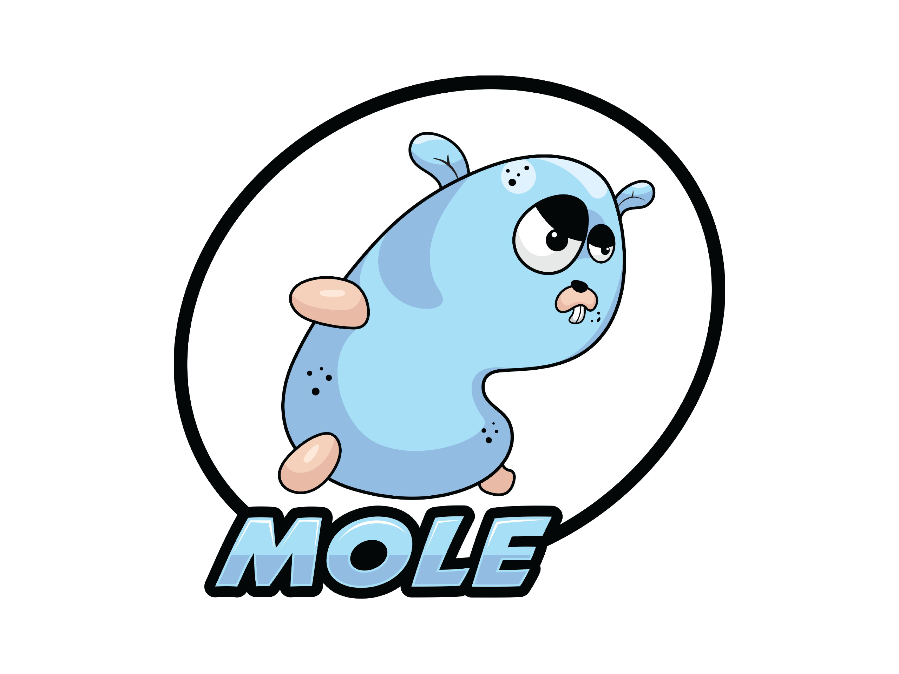

Mole is an experimental Network Intrusion Detection System that uses Yara as matching engine.

---

.**[Features](#features)** .
**[Supported OSes](#supported-oses)** .
**[Quickstart](#quickstart)** .
**[Documentation](#documentation)** .
**[Contributing](#contributing)** .

---

## Features

- Yara engine for packet matching
- PF_RING integration
- Rule configuration using meta fields from Yara (variables, ranges, ...)

## Supported OSes

- [Ubuntu 18.04.4 LTS (Bionic Beaver)](https://releases.ubuntu.com/18.04.4/) 
- [Debian GNU/Linux 10 (buster)](https://www.debian.org/releases/buster/)

Planned Windows 10 and MacOS X.

## Quickstart

To get your hands on Mole, you can use the [5-Minute Quickstart](https://docs.moleids.org/getting-started/quick-start/) in our documentation.

## Documentation

You can find the complete documentation of Mole at [https://docs.mole-ids.org](https://docs.mole-ids.org).

## Contributing

Please note that this project is released with a [Contributor Code of Conduct](CODE_OF_CONDUCT.md).
By participating in this project, you agree to abide by its terms.
